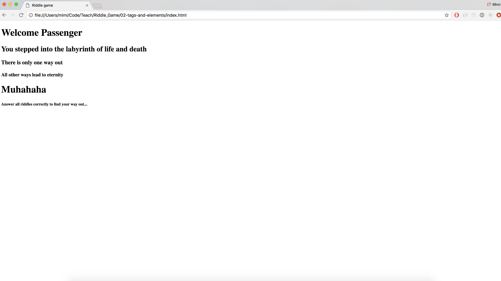

> ## Learning Goals
> 🎯 By the end of this part, you will...
> 1. understand what is CSS is used for
> 2. know what a selector, property and value in a CSS declaration
> 3. know what `<div> </div>` elements are used for
> 4. be able to add a background an element
> 5. be able to change the fonts of your text
> 6. be able to add an image

# CSS: Colors, Fonts and Backgrounds
## Adding some style
Your index page probably looks something like this:



A bit boring, still, right? Let's set some style! To do so, we'll need to write some CSS.

🙋 *CSS (Cascading Style Sheet) is used to style your web page.*

We need to tell our browser three things:

1. Which element(s) should be styled (**selector**)
2. What you want to change (**property**)
3. How it should be styled (**value**)


In this case, we want to style everything inside the body element, we want to change the color, and it should be gray.

🙋 *#333333 is a **hex color code**, representing the color grey. You can also mix your own color by using `rgb(r, g, b)` (see [this](https://htmlcolorcodes.com/) color picker to help you out) or by choosing one of the preset html colors (a list which can be found [here](https://htmlcolorcodes.com/color-names/)*

>  🎓 **Create a new file: `index.css`**

>  🎓 **Make sure your `index.html` knows about your new style sheet by adding the following code to your `<head> </head>` element:**

```HTML

<html>
  <head>
    <meta charset="utf-8">
    <title>Riddle game</title>
    <link rel="stylesheet" href="index.css">
  </head>
<!--leave the rest of the code as it is-->
```
🙋 *There are different ways of adding your CSS. Other ways are [inline styling](https://www.codecademy.com/articles/html-inline-styles) and [internal styling](https://www.w3schools.com/html/html_css.asp) However using a **separate stylesheet** is often considered best practice, because in this way your HTML-file is only used for structuring and your CSS-file only for styling.*

## Colors
>  🎓 **Have a look at the code  below. what do you think it does? Add it to your `index.css`-file**

```CSS

body {
  color: wheat;
}
```

## Backgrounds and divs
Let's now add a background image!

>  🎓 **Change the color of all your `<h1> </h1>` elements to `rgb(255, 64, 0)`**

>  🎓 **Add the following code to your CSS file**

```CSS
body {
  color: wheat;
  background-image: url(https://cdn.pixabay.com/photo/2016/10/24/23/11/doors-1767562_1280.jpg);
  background-size: cover;
}
```
>  🎓 **What happens when you remove `background-size: cover;`?**

>  🎓 **Change the url to the image address of a picture you like. You can find some cool images under the creative commons copyright [here](https://search.creativecommons.org/). Right click on the image and choose 'copy image address'**

Now, that looks way cooler already! The text might be easier to read if we would give it a steady background color though. Let's add a background color specifically behind the text. First we have to wrap all our text in  a 'container'. We'll call the box 'text'. This is the way to do so:

```HTML

<!-- Your head section -->
<body>
  
  <div class="text">
    <h1>Welcome Passenger</h1>
    <h2>You stepped into the labyrinth of life and death</h2>
    <h3>There is only one way out<h3>
    <h4>All other ways lead to eternity</h4>
    <h1>Muhahaha</h1>
    <h5>Answer all riddles correctly to find your way out...</h5>
  </div>
</body>
<!-- your html closing tag -->
```
🙋 *From [MDN](https://developer.mozilla.org/en-US/docs/Web/HTML/Element/div): The HTML Content Division element `<div>` is the generic container for flow content. (...) It's used to group content so it can be easily styled using the `class` or `id` attributes.*

Now, we'll use the class (text) as a selector, to color the background:

```CSS
.text {
  background-color: black;
}
```
> 🎓 **Add the code to your CSS file. Change to color to a color of your liking!**

## Fonts

That's way better. Let's add a font to our text! You add a font with the following css rule:

```CSS
p {
  font-family: "Goudy Bookletter 1911", sans-serif;
}
```

> 🎓 **What is the selector, in this example? What is the property of the declaration? What is the value?**

As you can see, in this case, our font-family property has a pair of values, a **generic font** and a **fall back font**. If the browser can't handle the generic font, it will use the fall back font instead.

On [fonts.google.com](https://fonts.google.com/), you can find some awesome fonts! To use them, you will first have to paste a link to the correct stylesheet in your `<head> </head>` section:

```HTML

<head>
  <meta charset="utf-8">
  <title>Riddle game</title>
  <link rel="stylesheet" href="index.css">
  <link href="https://fonts.googleapis.com/css?family=MedievalSharp" rel="stylesheet">
</head>
```
Our font is called MedievalSharp. We will specify it for everything in the body element in our css file:

```CSS
body {
  color: wheat;
  font-family: MedievalSharp, fantasy;
  background-image: url(https://cdn.pixabay.com/photo/2016/10/24/23/11/doors-1767562_1280.jpg);
  background-size: cover;
}
```
> 🎓 **Go to [fonts.google.com](https://fonts.google.com/) and pick a font you like. Click on 'select font'**

> 🎓 **In the 'family selected' window, copy the link element into the head section of your html file**

> 🎓 **Copy the css rule under it into your css file**

## Images
Finally, let's add a guide to our game. Let's add an image!

> 🎓 **Add the following code to your CSS file:**

```HTML

<!-- here's the head section -->
<body>
  
  <div class="text">
<!-- here is the rest of your code -->
```
Notice how we only have one image tag? If a tag ends with a / such as ``, it is an opening and a closing tag all at once. Our image has two **attributes**: a `src`, with a url to the image (again, copy the image address!) and an `alt`, with a descriptive text of what the image looks like.

> 🎓 **In your css-file, style your image. Use `img` as your selector, `height` as your property and `20rem` as a value. Don't forget to end your declaration with a semi-colon!**

🙋 *`rem` is one of the ways of specifying the height or width of an element. Other ways are `em`, `px` and sometimes `%`. More info on what they are exactly can be found [here](https://www.futurehosting.com/blog/web-design-basics-rem-vs-em-vs-px-sizing-elements-in-css/)*

## Loose

> 🎓 **Create a file `loose.css`. Add the link to the style sheet in the head section of your `loose.html`**

> 🎓 **Update the background of your page with a picture or a color**

> 🎓 **Change the color of your text and pick a nice font**

> 🎓 **Add an image to your page.**
